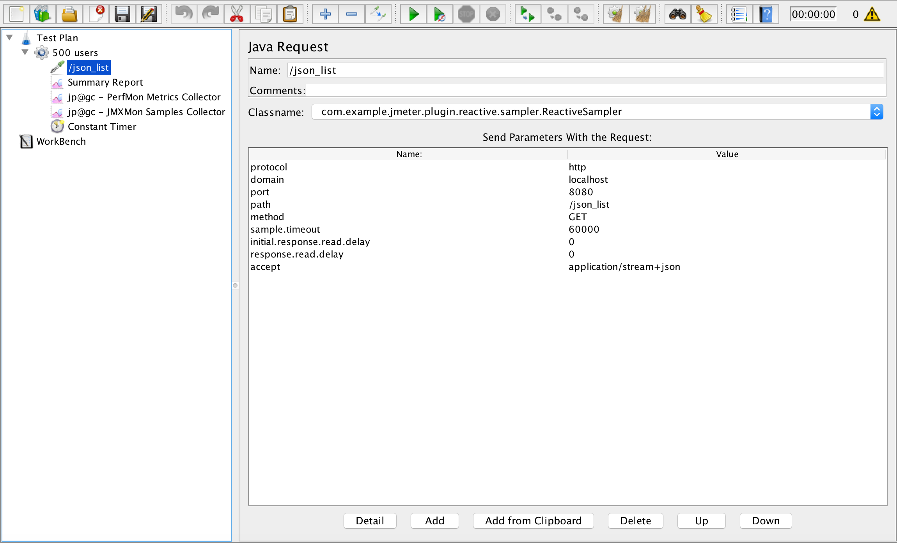

## Build
```
./gradlew clean build shadowJar
```

## Setup Apache JMeter
1. Download `Apache JMeter 3.1`
2. Copy `./build/lib/jmeter-plugins-reactive-0.0.1-SNAPSHOT-all.jar` to `<Apache-JMeter-Home>/lib/ext`
3. Copy `./config/user.properties` to `<Apache-JMeter-Home>/bin`
4. Copy `./config/500users.jmx` to `<Apache-JMeter-Home>/bin`
5. Setup Servers Performance Monitoring as described here https://jmeter-plugins.org/wiki/PerfMon/
6. Setup JMXMon Sample Collector as described here https://jmeter-plugins.org/wiki/JMXMon/

## Run
1. Start the application
2. Start the server agent for the server performance monitoring
3. Enter `<Apache-JMeter-Home>/bin` and execute the test with running the command below
```
./jmeter.sh -n -t 500users.jmx
```
4. Enter `<Apache-JMeter-Home>/bin` and generate the graphs with running the command below
```
./jmeter.sh  -g ./summary.csv  -o ./temp/report
```
- `./summary.csv` - this is the file generated during the test execution. It is configured as `ReactiveResultCollector` `filename` property.
- `./temp/report` - this is the location where the report will be generated

## Configuration
The test can be configured either directly editing the `jmx` file (e.g. `500users.jmx`) or via Apache JMeter GUI
